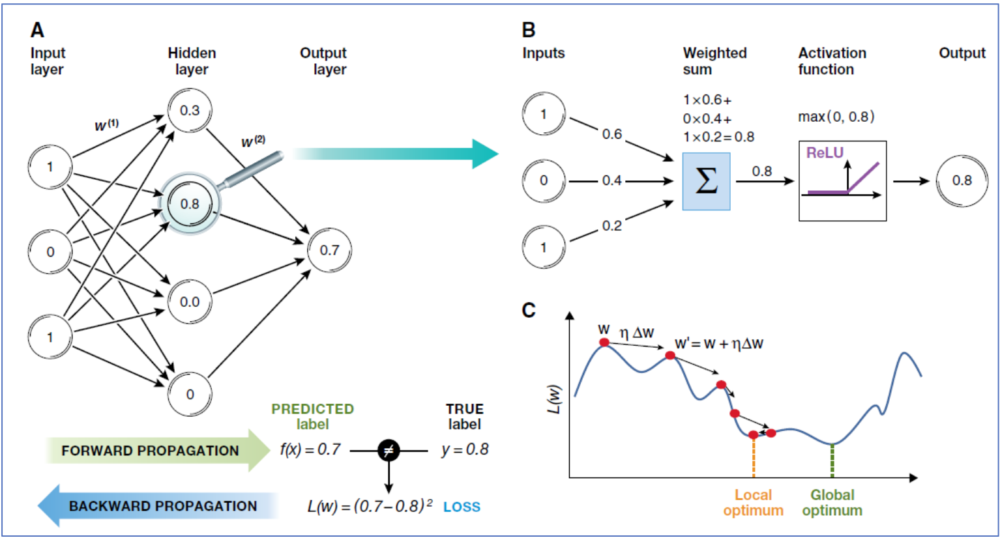

# 第一堂课笔记

## 生信"四步"流程

#### **零、提出问题**       

生物、物理、哲学    RNG：**R**obot、**N**anotech、**G**enetics

#### **一、获取信息**

图片、**序列**信息

#### **二、提取&分析**

人类科技史上彻底改变世界的三大工程：

- 人类<u>基因组计划</u>

  NGS 的种类：DNA-seq，RNA-seq，Epigenetics，Interaction......（第一次人类全基因组测序被Nature&Science 抢着发表

- 阿波罗登月计划

- 曼哈顿原子弹计划

个人和医学测序产生的大数据：大规模、高维度，学习自由识别和提取信息

#### 三、建模&算法

##### 1. 算法和模型的区别：

| **概念**     | 算法（Algorithm）                  | 模型（Model）                        |
| ------------ | ---------------------------------- | ------------------------------------ |
| **定义**     | 解决问题的明确步骤或规则集合       | 对数据或系统行为的数学或逻辑抽象表示 |
| **本质**     | **过程**（如何做？）               | **结果**（是什么？）                 |
| **依赖关系** | 算法可以独立于模型存在             | 模型通常需要通过算法构建或训练       |
| **示例**     | 排序算法、梯度下降、决策树生成规则 | 线性回归方程、神经网络结构、随机森林 |

想要进行快速应用，步骤可以是：**选算法 → 用代码实现 → 训练出模型**	

##### **2. 有关机器学习的概念：**

###### A. 神经网络的前向传播和反向传播

- *前向传播（Forward Propagation）*：输入数据通过输入层、隐藏层，最终到达输出层，生成预测值。
- *反向传播（Backward Propagation）*：计算预测值与真实值之间的误差（损失），并根据误差调整网络的权重。

###### B. 单个神经元的计算过程

- *输入（Inputs）*：神经元接收多个输入信号。
- *加权求和（Weighted sum）*：每个输入信号乘以其对应的权重，然后求和。
- *激活函数（Activation function）*：对加权求和的结果应用激活函数（如ReLU），生成输出，变为非线性。
- *输出（Output）*：神经元的最终输出。

###### C. 权重更新过程

- *损失函数（Loss function）*：衡量预测值与真实值之间的误差。
- *梯度下降（Gradient descent）*：通过计算损失函数对权重的梯度，更新权重以最小化损失。
- *局部最优（Local optimum)与全局最优（Global optimum）*：在权重更新过程中，可能会遇到局部最优解，目标是找到全局最优解。

多层神经网络叠加，"深度"学习。

##### 3. 猜想趋势（**Hypothesis Driven）** or 数据驱使（**Data Driven）**？

生物信息学更多是数据驱使，典型的数据驱使：达尔文进化论与孟德尔豌豆杂交实验

##### 4. 生物信息学是生命的语言学

##### 5. 课后回答问题：

- **题目**：鸡兔同笼问题，共有14个头，38条腿，求鸡和兔子各有多少只？

- **解法**：

  小学解法：假设全是鸡，多出的腿数除以2即为兔子数量。

  中学解法：设鸡为x，兔为y，根据头数和腿数建立方程组求解。

## 本学期生物信息学学习计划

### 总体目标：

学习生物信息学的信息调用方法和分析处理技巧，在前六周学习基础的编程手段，学习Linux 和R 语言的基本使用，在 2-12 周跟着课程计划学习NGS 数据分析方法，后四周进行机器学习的入门。我选择了机器学习相关的小组pre，希望对此方面了解深入，与两位同组成员协作，做到能“教”他人，经过学习和尝试后有可能将其应用到毕设中去。

### 每次课堂的小目标：

课堂上学习理论，学习大致的总体实操流程；课下以作业为载体，进行实操。作业保质保量完成，相信必然会有收获。